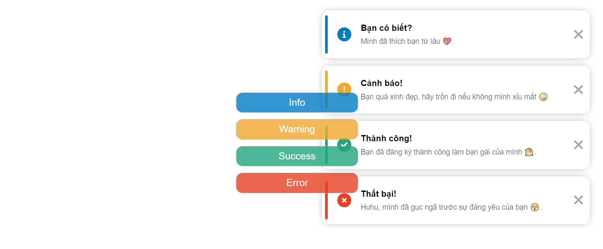
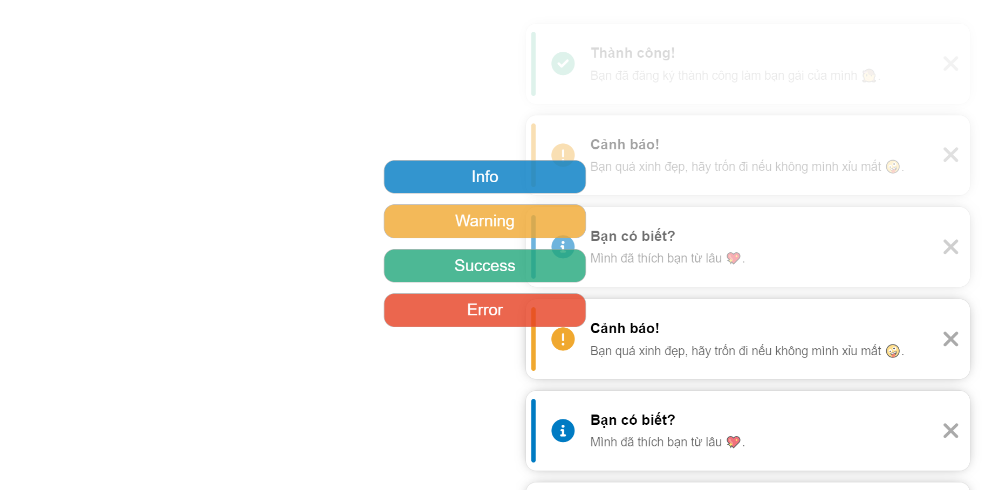
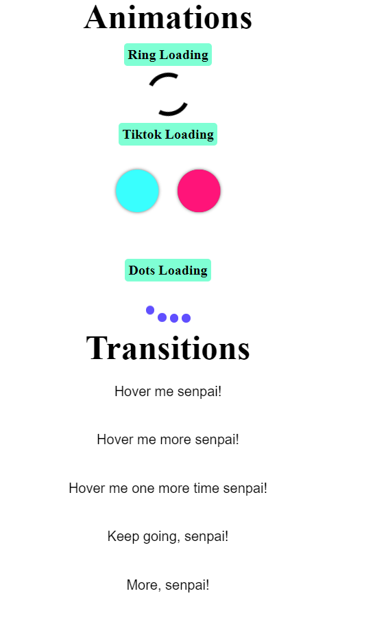
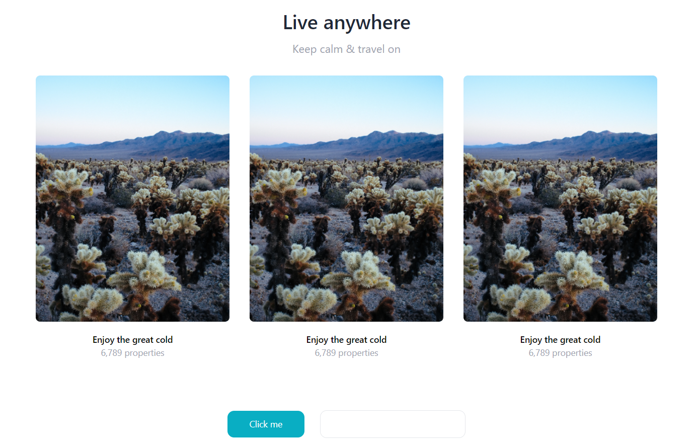
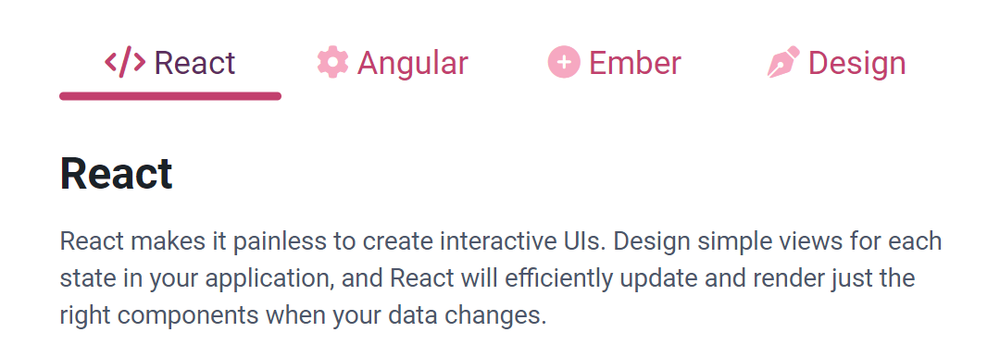

# ✨ Collection of Web Dev Practices ✨

Lưu trữ các project nho nhỏ, thực hiện trong quá trình học phát triển web.

## Mục lục

| Tên project                                    |                            Kiến thức vận dụng                             | Thời gian thực hiện |
| :--------------------------------------------- | :-----------------------------------------------------------------------: | ------------------: |
| [Tribute Page](tribute_page/index.html)        |                             HTML & CSS cơ bản                             |             06/2021 |
| [Pokewiki](pokewiki__fetchAPI/index.html)      | CRUD với fetchAPI của JS, Mock API với json-server, Object, Destructuring |          30/01/2022 |
| [Yugioh Cards](yugioh__BEM/index.html)         |                     Flexbox & DOM cơ bản, Transition                      |          16/02/2022 |
| [Toast Message](toast_message__DOM/index.html) |                           Flexbox & DOM cơ bản                            |          16/02/2022 |
| [Animation](animation/index.html)              |                     Animation, Transition, Transform                      |          19/02/2022 |
| [TailwindCSS](tailwind/index.html)             |                                TailwindCSS                                |          21/02/2022 |
| [Grid System](grid_system/index.html)          |                    Dựng bố cục layout bằng Grid System                    |          27/02/2022 |
| [Tabs UI](tabs_ui__DOM/index.html)             |                      HTML & CSS nâng cao, DOM cơ bản                      |          09/03/2022 |

## Demo

### 💬 Toast Message

Luyện tập quy tắc đặt tên BEM, đồng thời sử dụng `animation` và DOM.

### 🎥 Animation

Tổng hợp các hiệu ứng chuyển động đơn giản sử dụng các thuộc tính `animation`, `transition` và `transform`.

### 🍃 TailwindCSS

Ứng dụng thư viện TailwindCSS để chia layout và làm style đơn giản.

### 🎉 Tabs UI

Vận dụng kiến thức về DOM, pseudo element, `transition` và phương thức `forEeach` để làm ra giao diện chuyển tab đơn giản.

## Về tác giả

[Github](https://github.com/marucube35)\
[Facebook](https://www.facebook.com/profile.php?id=100009916021095)
